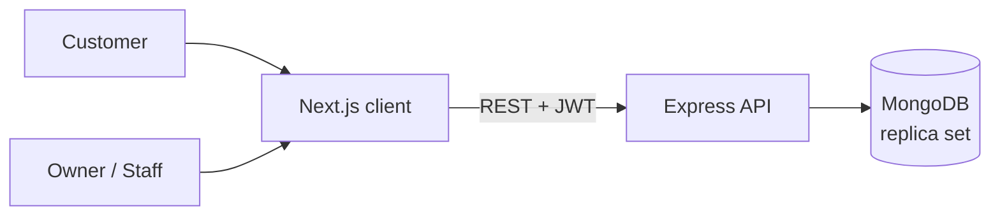
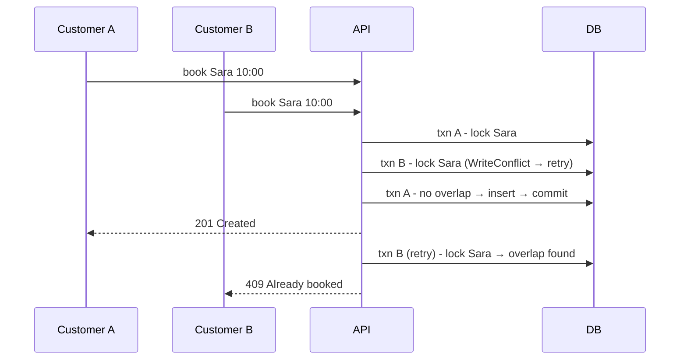

# BookFlow

**Multi-tenant appointment booking platform** for salons, clinics, gyms and training centers.
Every business gets its own booking page; customers pick a service, a staff member and a free time slot - and **double bookings are impossible, even under concurrent requests**.

🔗 **Live demo:** [book-flow-eight.vercel.app](https://book-flow-eight.vercel.app) &nbsp;·&nbsp; 🌐 Arabic (RTL) + English

| Try it as | Email | Password |
|---|---|---|
| Customer | `customer@demo.com` | `password123` |
| Business owner | `owner@demo.com` | `password123` |
| Staff member | `sara@demo.com` | `password123` |

> The login page also has one-click demo buttons.
> ⏳ The API runs on Render's free tier - if it was asleep, the first request can take ~50 seconds.

<!-- SCREENSHOTS (hidden until the images exist): add the 4 PNGs to docs/screenshots/,
     then delete these 2 lines and the closing comment line under the table.
| Booking page | Business dashboard |
|---|---|
|  |  |
| **My appointments** | **Arabic / RTL** |
|  |  |
-->

---

## Features

**Customers**
- Browse businesses and book in 5 steps: service → staff → day → free time → confirm
- Only real free slots are offered (working hours, existing bookings, past times all excluded)
- Choices survive the login redirect - pick first, log in after
- "My appointments": upcoming & past, cancel with confirmation

**Business owners & staff**
- Business sign-up creates the business **and** its owner in one transaction
- Daily schedule with status workflow: `pending → confirmed → completed / no-show`, or `cancelled`
- Manage services (soft delete), staff accounts (deactivate / reactivate) and weekly working hours
- Staff see only **their own** appointments - enforced by the API, not the UI

**Platform**
- Full Arabic / English with RTL layout, no flash on load (language stored in a cookie, read on the server)
- Backend error messages translated on the client
- One-click demo accounts + a seed script with realistic sample data

## Tech stack

| Layer | Tech |
|---|---|
| Frontend | Next.js 16 (App Router), React 19, TypeScript, Tailwind CSS 4 |
| Backend | Node.js, Express 5, Mongoose 9 |
| Database | MongoDB (replica set - required for transactions) |
| Auth & security | JWT, bcrypt, express-rate-limit, CORS allow-list |

## Architecture



The repo is a monorepo: `client/` (Next.js) and `server/` (Express) are deployed separately.

## Technical decisions

These are the parts I found most interesting to solve.

### 1. Preventing double bookings (race condition)
Checking "is this staff member free?" and then saving is **two** steps. Two customers booking the same slot at the same millisecond can both pass the check before either one saves.

The fix: every staff member has a small **lock document**. A booking runs inside a MongoDB **transaction** that first writes to that lock, then checks for overlaps, then inserts. A second concurrent transaction on the same staff member hits a `WriteConflict`, is retried automatically - and on retry it sees the first booking and gets **409 Conflict**.



Proven by [`server/practice/test-race.js`](server/practice/test-race.js): it fires **10 bookings for the same slot at once** - exactly 1 succeeds, the other 9 get 409.
On the frontend, a 409 reloads the free slots so the taken time disappears.

### 2. Multi-tenancy & data isolation
- `tenantId` comes **only** from the verified JWT - never from the body, query or URL.
- Every query by id also filters by `tenantId`, so another business's data simply "doesn't exist" (**404, not 403** - we don't even confirm it exists). This prevents IDOR.
- The business's `isActive` flag is checked on **every** request, because a JWT stays valid after an admin disables the business.
- Public endpoints return hand-built DTOs: staff are exposed as `{ id, name }` only.

### 3. Time zones
A business says "10:30" in **its** local time; MongoDB stores UTC. The server converts local ↔ UTC using the business's IANA time zone (e.g. `Asia/Hebron`), "today" is computed in the business's zone, and calendar dates (`2026-10-03`) are never parsed as moments - so a customer abroad never sees the wrong day.

### 4. Appointment state machine
Allowed transitions live in one map (`completed`, `cancelled`, `no-show` are final), plus time rules (can't mark "completed" before it starts). Updates are **atomic compare-and-set**: `findOneAndUpdate({ _id, status: current })` - if the customer cancelled a second earlier, the owner's update fails with 409 instead of silently overwriting it.

### 5. Other details
- **Price snapshot:** an appointment copies the service's name/price/duration, so editing a service never rewrites history.
- **Soft deletes** for services and staff - old appointments keep valid references.
- **Mass-assignment protection:** controllers whitelist the fields a client may set; `role` and `tenantId` are always set by the server.
- **Brute-force protection:** rate limits on login/registration/public routes (`trust proxy` set in production so limits work behind a hosting proxy).
- **Fail-fast config:** the server refuses to start with missing env vars or a weak `JWT_SECRET`.
- **i18n without a library:** a typed dictionary - TypeScript fails the build if an Arabic key is missing.

## Project structure

```
BookFlow/
├── client/                  Next.js frontend
│   └── src/
│       ├── app/             pages: book/[slug], businesses, dashboard, my-appointments, login, register...
│       ├── components/      Navbar, RequireAuth, StatusBadge, dashboard/ tabs
│       ├── context/         AuthContext (who is logged in)
│       ├── i18n/            dictionaries (ar/en) + LanguageContext
│       └── lib/             api client, types, date/price formatting
├── server/                  Express API
│   ├── src/
│   │   ├── controllers/     business logic per resource
│   │   ├── middlewares/     auth, tenant, rate limit, errors
│   │   ├── models/          Mongoose schemas
│   │   ├── routes/
│   │   └── utils/time.js    time-zone & overlap helpers
│   ├── scripts/seed.js      demo data
│   ├── practice/            race-condition & overlap experiments
│   └── api-tests.http       every endpoint, runnable in VS Code REST Client
└── render.yaml              backend deploy blueprint
```

## Run locally

**Requirements:** Node.js 20+ and a MongoDB **replica set** (transactions need one).
The easiest option is a free [MongoDB Atlas](https://www.mongodb.com/atlas) cluster. A plain local `mongod` will **not** work unless you start it as a single-node replica set.

```bash
# 1) Backend
cd server
cp .env.example .env        # set MONGO_URI and a JWT_SECRET of 32+ characters
npm install
npm run seed                # demo business, staff, customers and sample bookings
npm run dev                 # http://localhost:5000

# 2) Frontend (new terminal)
cd client
cp .env.example .env.local
npm install
npm run dev                 # http://localhost:3000
```

Generate a secret: `node -e "console.log(require('crypto').randomBytes(64).toString('hex'))"`
Reset the demo data any time: `npm run seed -- --reset`

### Tests
```bash
cd server
npm test
```
21 API tests (Jest + Supertest): 10 concurrent bookings for the same slot (exactly 1 wins), tenant isolation (404 across businesses), the status state machine and cancellation rules.
Locally they run against a separate `bookflow_test` database on your `MONGO_URI` cluster (the app's own database is never touched);
on GitHub Actions they run on every push against a MongoDB replica set started in Docker.

## Deployment

| Part | Host | Settings |
|---|---|---|
| Database | MongoDB Atlas (free M0) | Network access: allow `0.0.0.0/0` |
| Backend | Render (free) | Blueprint from `render.yaml` - set `MONGO_URI` and `CLIENT_URL` |
| Frontend | Vercel | Root directory `client`, env `NEXT_PUBLIC_API_URL=https://<render-app>.onrender.com/api` |

> Render's free tier sleeps after 15 minutes of inactivity - the first request can take ~50 seconds.

## API overview

| Method | Endpoint | Access |
|---|---|---|
| POST | `/api/auth/register` · `/api/auth/login` · `/api/auth/register-business` | public |
| GET | `/api/auth/me` | logged in |
| GET | `/api/public/businesses` · `/api/public/businesses/:slug` · `/api/public/businesses/:slug/availability` | public |
| POST | `/api/appointments` | customer |
| GET · PATCH | `/api/appointments/me` · `/api/appointments/:id/cancel` | customer |
| GET · PATCH | `/api/appointments/business` · `/api/appointments/:id/status` | owner, staff |
| CRUD | `/api/services` | owner (staff: read) |
| CRUD | `/api/staff` | owner |
| GET · PUT | `/api/tenants/me` · `/api/tenants/me/working-hours` | owner (staff: read) |

Full request examples: [`server/api-tests.http`](server/api-tests.http).

## Known limitations & roadmap

- [x] Automated tests (Jest + Supertest) and CI - 21 tests: concurrent double booking, tenant isolation, status transitions
- [ ] JWT in an httpOnly cookie instead of `localStorage`
- [ ] Email reminders 24h before an appointment (background job queue)
- [ ] Per-staff working hours and "which staff can do which service"
- [ ] Analytics on the dashboard (bookings, revenue, no-show rate)
- [ ] A `pending` appointment that nobody confirmed can't be closed after its start time

## Author

**AbdAlrhmn ALkhlwt** - Full-Stack JavaScript Developer · [GitHub](https://github.com/abdalrhmn2021)
